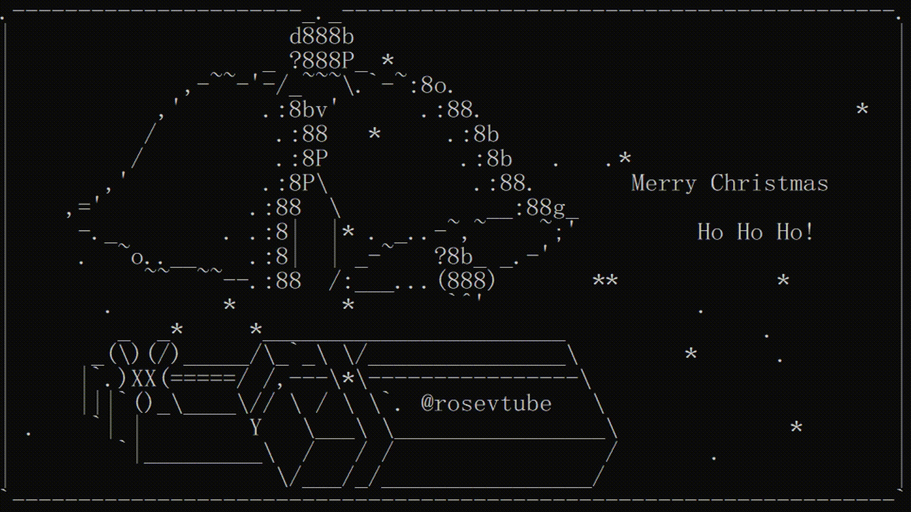

# CHRISTMAS2022

My very first stupid simple ascii animation.

# Installation
> pip install -r requirements.txt

# Run
After you install requirements and then you just run the command
> python christmas2022

Idea from https://ascii.co.uk/
